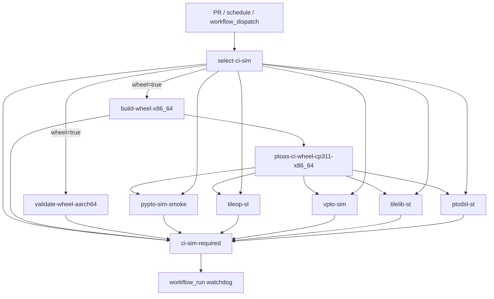

// Copyright (c) 2026 Huawei Technologies Co., Ltd.
// This program is free software, you can redistribute it and/or modify it under the terms and conditions of
// CANN Open Software License Agreement Version 2.0 (the "License").
// Please refer to the License for details. You may not use this file except in compliance with the License.
// THIS SOFTWARE IS PROVIDED ON AN "AS IS" BASIS, WITHOUT WARRANTIES OF ANY KIND, EXPRESS OR IMPLIED,
// INCLUDING BUT NOT LIMITED TO NON-INFRINGEMENT, MERCHANTABILITY, OR FITNESS FOR A PARTICULAR PURPOSE.
// See LICENSE in the root of the software repository for the full text of the License.

# PTOAS CI Shared Wheel And Simulator Fan-Out Design

## 1. Background

The former `ci-sim` workflow built PTOAS from source in multiple Python
environments and ran PyPTO, TileOp, VPTO, TileLib, and PTODSL validation in one
long-lived job. This caused three problems:

- Different suites could test wheels or editable installations produced by
  different builds.
- One suite failure required the entire build and all preceding suites to run
  again.
- Changes unrelated to simulator behavior still consumed expensive wheel and
  self-hosted simulator capacity.

The current design builds one repaired x86_64 CPython 3.11 wheel and fans that
exact artifact out to independently selected simulator suites. It also keeps
an aarch64 CPython 3.11 wheel build as an independent packaging validation.

## 2. Goals

- Use one self-contained wheel as the only PTOAS installation source for all
  simulator consumers in one CI run.
- Isolate failures and failed-job reruns at the suite boundary.
- Skip expensive validation only for explicitly non-code changes.
- Keep a stable `ci-sim-required` branch-protection interface.
- Warm PR wheel compilation from a bounded main-branch ccache while preserving
  clean publication builds.
- Make producer, suite, and critical-path durations observable.

## 3. Non-Goals

- Splitting the regular `build-and-test` workflow.
- Parallelizing TileLib internally at the operator or testcase level.
- Changing PTOAS compiler behavior, Python APIs, or wheel payload semantics.
- Installing `torch_npu` dynamically on self-hosted runners.
- Making release, scheduled publication, or manual publication builds depend
  on ccache.

## 4. Workflow Topology

The PR workflow is defined in `.github/workflows/ci_sim.yml`.

Only selected suite jobs run. All suite jobs depend on the x86_64 producer, so
a producer failure prevents consumers from starting. The required gate uses
`if: always()` and distinguishes these dependency skips from legal unselected
skips.

## 5. Changed-Path Selection

`.github/scripts/classify_ci_sim_changes.py` is the source of truth for suite
selection. It emits:

- `wheel`
- `pypto`
- `tileop`
- `vpto`
- `tilelib`
- `ptodsl`
- `matched_paths`
- `selection_reason`

For pull requests, `select-ci-sim` obtains the complete changed-file list from
the GitHub Pull Request Files API with pagination. It does not use a local
two-point or three-point Git diff, so fork PR heads and base commits that are
not present in the checkout do not break selection. Rename entries classify
both the new and previous path conservatively.

### 5.1 Direct Suite Ownership

| Changed path | Selected suite |
| --- | --- |
| `test/vpto/**` | VPTO |
| `test/tilelib-st/**` | TileLib |
| `test/dsl-st/**` | PTODSL |
| `test/tilelang_st/**` | TileOp |

Changes confined to several direct test areas select the union of their
owners. Non-code files may accompany direct test changes without expanding the
selection.

### 5.2 Conservative Fallback

Any shared source, build definition, CI support file, or unknown path selects
all five suites. This is intentional: an unclassified code path must increase
coverage rather than silently omit a dependent suite.

Heavy validation is skipped only when every changed file is explicitly
non-code. The allowlist includes documentation and Markdown, OpenSpec planning
artifacts, issue templates, licenses, and a small set of repository metadata
files.

Schedule and workflow-dispatch events bypass PR path selection and always run
both wheel architectures and all five suites.

Before classifying a run, `select-ci-sim` executes both
`.github/scripts/test_classify_ci_sim_changes.py` and
`.github/scripts/test_ci_sim_duration_warning.js`. A regression in selection
or duration-observer behavior therefore fails CI instead of silently
accumulating in an unreferenced test script.

## 6. Shared Wheel Producer

`.github/workflows/_build_linux_wheel.yml` is a reusable workflow shared by
`ci-sim` and `.github/workflows/build_wheel.yml`.

The producer contract is:

- Python ABI: CPython 3.11 for `ci-sim`.
- Consumer architecture: x86_64.
- Platform tag: `manylinux_2_34_x86_64`.
- Artifact name: `ptoas-ci-wheel-cp311-x86_64`.
- Artifact contents: exactly one repaired compatible wheel.
- LLVM/MLIR: statically linked into the PTOAS compiler payload.

Artifact names remain stable so failed consumer jobs can download the producer
artifact from the same workflow run. Uploads use `overwrite: true`, allowing a
watchdog `rerun-failed-jobs` attempt to replace an artifact previously uploaded
by the same job instead of failing with an immutable-artifact conflict.

The reusable build retains payload validation, `auditwheel repair`, isolated
wheel installation tests, native dependency checks, and optional binary
archive generation. The aarch64 job performs the same wheel validation but
does not upload a consumer artifact.

The standalone wheel workflow no longer has a pull-request trigger. Main,
release, schedule, and workflow-dispatch publication paths continue to call
the reusable workflow.

## 7. Ccache Policy

PTOAS compilation uses ccache only for PR and default-branch wheel builds.

The cache identity contains:

- target architecture;
- CPython version/ABI;
- resolved LLVM source SHA;
- compiler identity;
- versioned LLVM/wheel cache flavor;
- main commit SHA for saved entries.

PR jobs restore from the compatible main prefix and never save a PR-specific
cache. Successful main builds may save a cache capped at 2 GiB. Release,
scheduled publication, and manual publication builds do not restore, save, or
configure ccache compiler launchers.

The warm-cache x86_64 producer target is approximately six minutes. Ten
minutes is the P95 budget evaluated from a representative warm-cache sample,
not a per-run alert threshold. A cold LLVM cache is expected after an LLVM
revision change, so the watchdog uses the overall critical-path soft budget for
single-run warnings.

## 8. Consumer Contract

All five consumers use the repository-local composite action
`.github/actions/setup-ci-sim-consumer/action.yml`.

The action:

1. Downloads `ptoas-ci-wheel-cp311-x86_64`.
2. Requires exactly one compatible wheel.
3. Creates a suite-specific virtual environment under `RUNNER_TEMP`.
4. Installs with `pip install --no-deps --force-reinstall`.
5. Probes `ptoas`, MLIR Python bindings, and PTODSL imports.
6. Records the consumed wheel SHA256 in the suite log directory.

Consumers must not use editable PTOAS installation, build PTOAS or LLVM, or
refer to the producer build tree.

### 8.1 Suite Jobs

| Job | Runtime contract | Test entry point |
| --- | --- | --- |
| `pypto-sim-smoke` | Isolated Python 3.11; CPU Torch and pinned PyPTO/PTO-ISA dependencies | `.github/scripts/run_pypto_sim_smoke.sh` |
| `tileop-st` | Isolated Python 3.11 and detected CANN installation | `test/tilelang_st/script/run_ci.sh` |
| `vpto-sim` | Python 3.11 with preinstalled `torch` and `torch_npu` | `test/vpto/scripts/run_host_vpto_validation_parallel.sh` |
| `tilelib-st` | Python 3.11 with preinstalled `torch` and `torch_npu` | `scripts/sim_dsl.sh test/tilelib-st/run_tilelib_st.py` |
| `ptodsl-st` | Python 3.11 with preinstalled `torch` and `torch_npu` | `scripts/sim_dsl.sh test/dsl-st` |

The DSL-related jobs use `.github/scripts/find_torch_npu_python.sh`. Missing a
compatible interpreter is a runner-contract failure; the job must not fall
back to another PTOAS build or Python ABI.

Each job has independent work, temporary, virtual-environment, and log paths.
Artifacts are suite-specific and always include the wheel digest when setup
completed.

## 9. Required Gate

`ci-sim-required` is the stable branch-protection result. It depends on path
selection, both architecture wheel jobs, and all five suite jobs.

For each job the gate applies this rule:

| Selection | Required conclusion |
| --- | --- |
| Selected | `success` |
| Unselected | `skipped` |

Consequently:

- a selected suite failure fails the gate;
- a wheel producer failure fails the gate;
- a consumer skipped because its producer failed is not accepted as an
  unselected skip;
- a non-code-only PR succeeds when producers and consumers are all legally
  skipped;
- selection failure always fails the gate.

The gate writes a table of selection and job conclusions to the workflow step
summary.

## 10. Watchdog And Observability

`.github/workflows/watchdog.yml` runs after `ci-sim` completes.

### 10.1 Automatic Retry

The watchdog downloads failed-job logs and requests
`rerun-failed-jobs` only when they match recognized Git or network failures,
such as connection timeout, DNS resolution, TLS, RPC, or early-EOF errors.
Functional compiler or suite failures are never automatically retried.

For PRs, the watchdog verifies that the PR remains open and that the workflow
SHA is still the current PR head before requesting a rerun. The run-attempt
limit prevents retry loops.

### 10.2 Duration Reporting

`.github/scripts/ci_sim_duration_warning.js` reports:

- x86_64 wheel producer duration;
- duration of each selected, completed suite;
- critical path from producer start to `ci-sim-required` completion;
- the six-minute producer target and ten-minute advisory budget.

The existing `ci-slow` label and PR comment remain advisory and do not change
functional conclusions. The watchdog removes the label only while resolving
its own active warning comment; a manually applied label is otherwise left
untouched.

## 11. Security And Isolation

- The PR workflow receives read-only repository and pull-request permissions.
- Consumer checkouts disable persisted credentials.
- The watchdog executes scripts checked out from the default branch, not from
  untrusted PR content.
- Consumer state is isolated by job and suite-specific `RUNNER_TEMP` paths.
- Wheel identity and digest checks prevent accidental source fallback or
  cross-run artifact ambiguity.

## 12. Rollout Status

The workflow implementation is present, but rollout validation is not yet
complete.

During migration, the old `vpto-sim-validation` job remains as a non-blocking
comparison path. Its artifacts use a `legacy-` prefix, and it is not evaluated
by `ci-sim-required`. It should be removed after representative full and
targeted PRs pass the fan-out graph.

The following rollout work remains:

- execute clean x86_64 and aarch64 builds on GitHub runners;
- exercise every consumer and compare their recorded wheel digests;
- validate path selection, failure propagation, and network-only reruns;
- collect at least ten warm-cache producer samples and evaluate P95;
- switch branch protection to `ci-sim-required`;
- document and test the operational rollback procedure.

## 13. Rollback

If the fan-out graph blocks normal development during rollout:

1. Restore the pull-request trigger in `.github/workflows/build_wheel.yml`.
2. Restore the legacy monolithic simulator job as the required validation.
3. Remove or stop requiring `ci-sim-required` in branch protection.

The reusable wheel workflow and path classifier can remain in the repository
while unused; they do not change compiler or release payload behavior.

## 14. Acceptance Criteria

- One relevant PR commit produces exactly one x86_64 consumer wheel artifact.
- Every selected consumer records the same wheel SHA256.
- Consumers do not build PTOAS or LLVM and do not install PTOAS editable.
- Direct test-only paths select only their owning suites; unknown paths select
  all suites; non-code-only changes select none.
- Both wheel architectures run whenever any suite is selected.
- `ci-sim-required` succeeds only for legal success/skip combinations.
- Functional failures are not automatically retried.
- Warm-cache producer P95 is no greater than ten minutes before rollout is
  considered complete.
